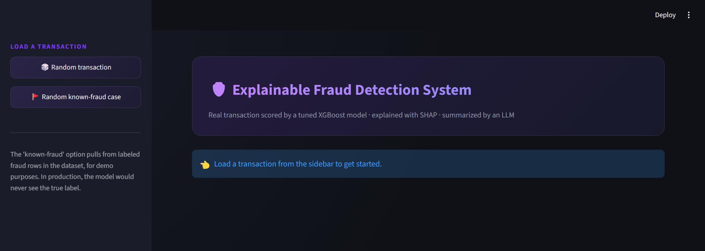
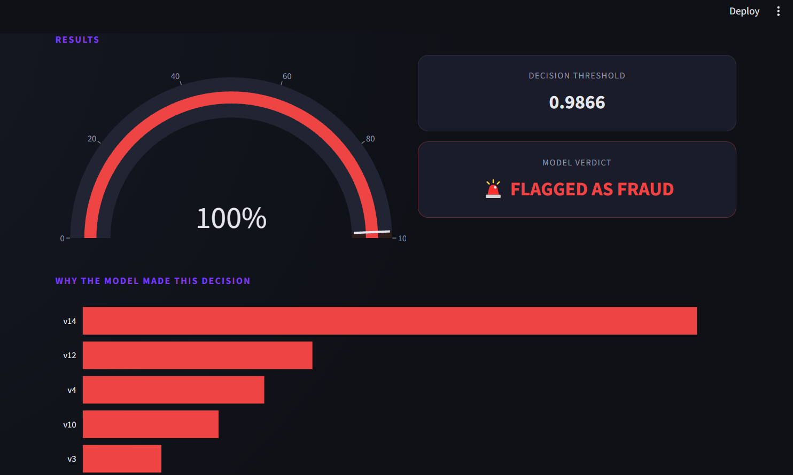
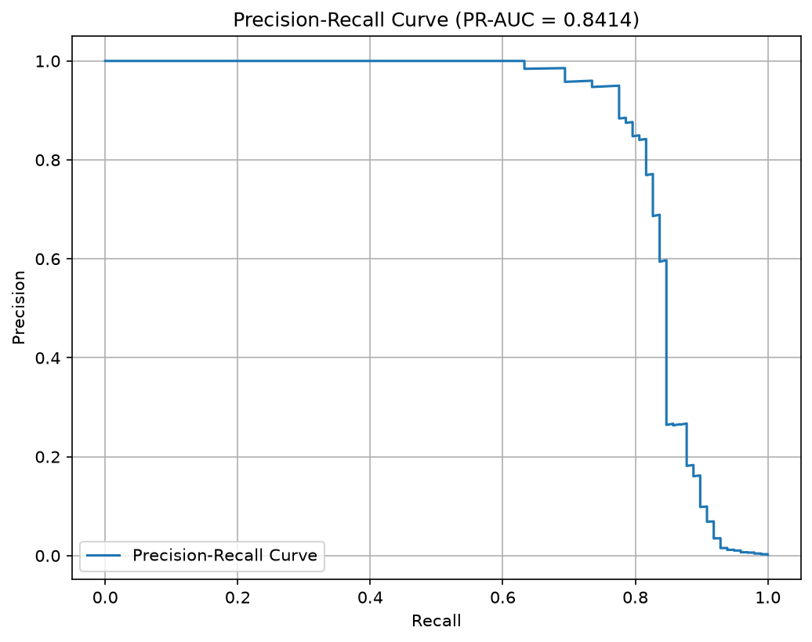
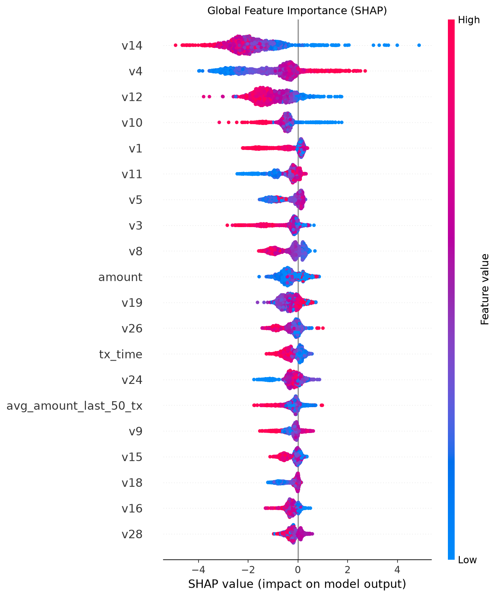
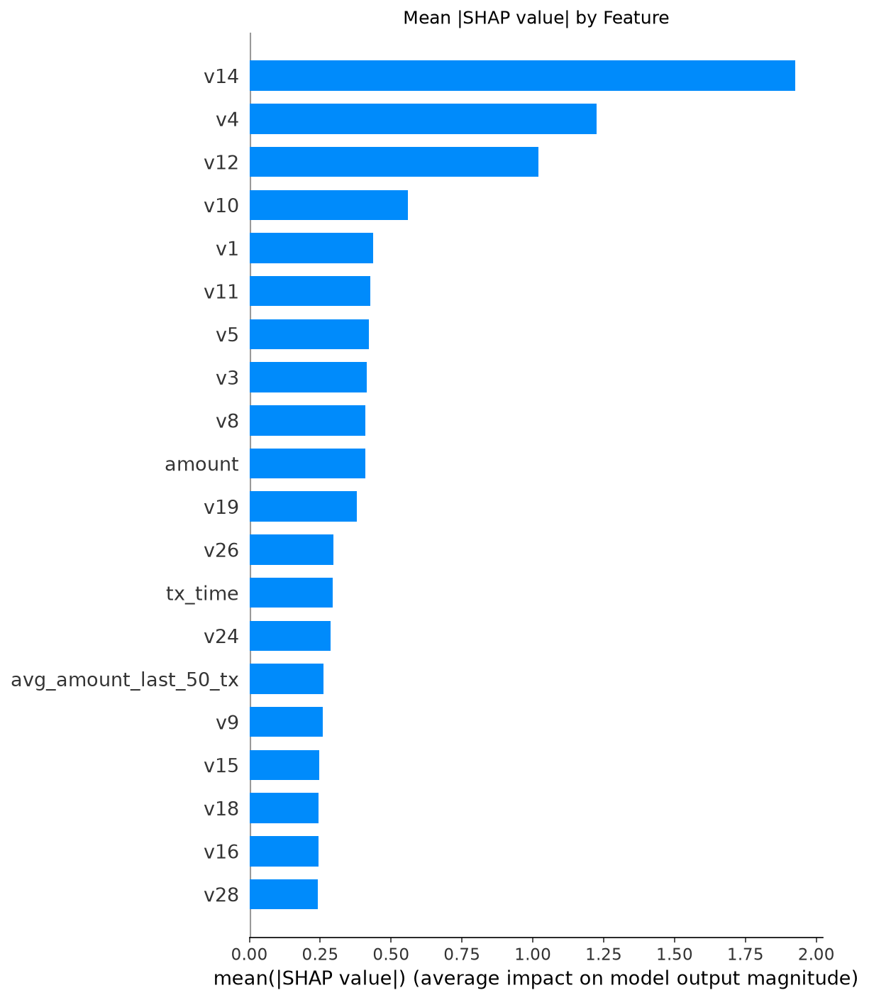
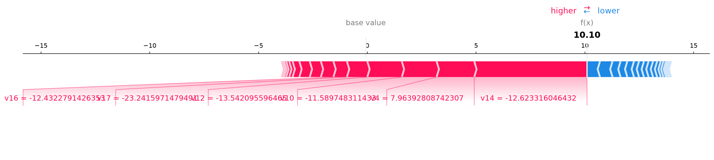

# 🛡️ Explainable Real-Time Fraud Detection System

An end-to-end machine learning system that detects credit card fraud in real time, explains *why* each decision was made using SHAP, and translates that explanation into plain English using an LLM — built as a portfolio project demonstrating SQL/database engineering, applied machine learning, model explainability, and GenAI integration.


---

---

## 🎬 Demo


*The Streamlit dashboard: load a transaction, view its fraud score, and see the SHAP-based explanation.*


*A known-fraud transaction correctly flagged, with the gauge, contributing features, and plain-English explanation.*


*The FastAPI interactive docs, showing the `/predict_explained` endpoint.*

---

## 🎯 Overview

Credit card fraud is rare (~0.17% of transactions in this dataset) but costly, making it a classic **imbalanced classification problem**. This project builds a full pipeline — from raw data in a relational database to a live, explainable, GenAI-narrated fraud-scoring service:

**Data (PostgreSQL) → Feature Engineering (SQL) → Model (XGBoost) → Explainability (SHAP) → API (FastAPI) → Plain-English Layer (LLM) → Demo UI (Streamlit)**

Rather than presenting a single black-box model with an accuracy score, this project focuses on the full decision-making story: how the imbalance problem was diagnosed, how different mitigation strategies were compared, how the operating threshold was chosen deliberately (not left at a default), and how the result is explained to a non-technical end user.

---

## ✨ Key Features

- 🗄️ **Real SQL/database usage** — data lives in PostgreSQL, with feature engineering done via window functions (`PERCENT_RANK`, rolling aggregations), not just pandas.
- ⚖️ **Proper handling of extreme class imbalance** — compared class-weighting vs. SMOTE, evaluated on PR-AUC rather than misleading accuracy.
- 🎯 **Data-driven threshold selection** — the classification threshold (0.9866) was chosen via precision-recall curve analysis, not left at the default 0.5.
- 🔍 **Explainable AI** — SHAP provides both global feature importance and per-transaction local explanations.
- 🤖 **GenAI integration with a real purpose** — an LLM turns SHAP's technical output into a plain-English explanation for a human fraud analyst, not a bolted-on chatbot.
- ⚡ **Real-time serving** — a FastAPI service scores transactions and returns explanations on demand.
- 🎨 **Interactive demo UI** — a Streamlit dashboard to visually explore predictions, SHAP contributions, and the LLM explanation.

---

## 🏗️ Architecture

```
┌─────────────────┐     ┌──────────────────┐     ┌─────────────────┐
│  Kaggle CSV      │ --> │  PostgreSQL       │ --> │  SQL Feature     │
│  (raw data)      │ ETL │  transactions      │     │  Engineering     │
└─────────────────┘     └──────────────────┘     └────────┬────────┘
                                                            │
                                                            v
┌─────────────────┐     ┌──────────────────┐     ┌─────────────────┐
│  Streamlit Demo  │ <-- │  FastAPI Service  │ <-- │  XGBoost Model   │
│  UI              │     │  (/predict,        │     │  + SHAP          │
│                  │     │   /predict_explained)│     │  Explainability  │
└─────────────────┘     └────────┬─────────┘     └─────────────────┘
                                  │
                                  v
                         ┌──────────────────┐
                         │  LLM (Gemini)     │
                         │  Plain-English     │
                         │  Explanation       │
                         └──────────────────┘
```

---

## 📊 Results

### Model Comparison (Imbalance Handling)

| Model | Precision | Recall | PR-AUC |
|---|---|---|---|
| Baseline (Logistic Regression) | 0.843 | 0.602 | 0.743 |
| XGBoost + class_weight (untuned) | 0.816 | 0.816 | **0.841** ✅ |
| XGBoost + SMOTE | 0.748 | 0.816 | 0.838 |
| XGBoost + class_weight (tuned) | 0.857 | 0.796 | 0.830 |

**Selected model:** untuned XGBoost + class_weight — chosen for the best PR-AUC, prioritizing recall (missed fraud is costlier than a false alarm in this domain). Notably, hyperparameter tuning slightly *reduced* PR-AUC, due to cross-validation variance from the very small positive-class sample (~394 fraud cases in training) — a real and instructive finding, not a discarded result.

### Threshold Selection

| Threshold | Precision | Recall | F1 |
|---|---|---|---|
| 0.5 (default) | 0.816 | 0.816 | 0.816 |
| **0.9866 (chosen — F1-optimal)** | **0.950** | **0.776** | **0.854** |
| 0.0042 (90% recall target) | 0.099 | 0.908 | 0.181 |

The 90%-recall option was evaluated and explicitly rejected: at that threshold, ~9 out of 10 flagged transactions would be false alarms, which would overwhelm a real fraud review team.

### Precision-Recall Curve


### SHAP Global Feature Importance



### Example: Local Explanation for a Flagged Transaction


---

## 🛠️ Tech Stack

| Layer | Tools |
|---|---|
| Database | PostgreSQL |
| Data manipulation | pandas, SQLAlchemy |
| Modeling | scikit-learn, XGBoost, imbalanced-learn (SMOTE) |
| Explainability | SHAP |
| API | FastAPI |
| GenAI | Google Gemini API |
| Demo UI | Streamlit, Plotly |
| Model persistence | joblib |

---

## 📁 Project Structure

```
fraud-detection/
├── schema.sql                  # PostgreSQL schema for raw transactions
├── load_data.py                 # ETL: loads Kaggle CSV into PostgreSQL
├── eda.py                       # Exploratory data analysis (Jupyter-style cells)
├── feature_engineering.sql      # SQL window functions; builds transaction_features table
├── baseline_model.py            # Baseline Logistic Regression model
├── imbalance_model.py           # class_weight vs. SMOTE vs. tuned XGBoost comparison
├── threshold_analysis.py        # Precision-recall curve, threshold selection
├── shap_explainability.py       # SHAP global/local explanations; saves fraud_model.joblib
├── llm_explainer.py              # Gemini-based plain-English explanation generator
├── api_v2.py                     # FastAPI service (/predict, /predict_explained)
├── demo_app.py                   # Streamlit demo UI
├── screenshots/                  # UI screenshots referenced in this README
│   ├── dashboard_main.png
│   ├── fraud_flagged.png
│   └── api_docs.png
├── .streamlit/
│   └── config.toml               # Dark theme configuration
├── fraud_model.joblib             # Saved trained model + threshold + feature list
└── README.md
```

---

## 🚀 Getting Started

### 1. Prerequisites
- Python 3.10+
- PostgreSQL running locally
- A free [Google AI Studio](https://aistudio.google.com/apikey) API key (for the LLM layer)

### 2. Install dependencies
```bash
pip install pandas sqlalchemy psycopg2-binary scikit-learn xgboost imbalanced-learn \
            shap joblib fastapi uvicorn google-genai streamlit requests plotly matplotlib seaborn
```

### 3. Set up the database
```bash
createdb fraud_detection
psql -d fraud_detection -f schema.sql
```

### 4. Download the dataset
Get `creditcard.csv` from the [Kaggle Credit Card Fraud Detection dataset](https://www.kaggle.com/datasets/mlg-ulb/creditcardfraud) and load it:
```bash
python load_data.py /path/to/creditcard.csv
```

### 5. Run the SQL feature engineering
Execute `feature_engineering.sql` against the `fraud_detection` database (e.g., via pgAdmin's Query Tool) to build the `transaction_features` table.

### 6. Train the model and generate SHAP explanations
```bash
python shap_explainability.py
```
This saves `fraud_model.joblib`, used by the API.

### 7. Set your Gemini API key
```bash
# Windows (cmd)
set GEMINI_API_KEY=your-key-here
```

### 8. Run the API
```bash
uvicorn api_v2:app --reload
```
Visit `http://127.0.0.1:8000/docs` for the interactive Swagger UI.

### 9. Run the demo UI
In a separate terminal:
```bash
streamlit run demo_app.py
```

---

## 💡 Design Decisions & Lessons Learned

- **Why PR-AUC over accuracy:** with ~0.17% fraud prevalence, a trivial "always legitimate" model scores ~99.8% accuracy while catching zero fraud. PR-AUC and recall are the metrics that actually matter here.
- **Why the tuned model wasn't automatically better:** hyperparameter search optimizes cross-validation performance, which is noisy with very few positive examples per fold — a good reminder that "tuned" doesn't always mean "better on the metric you actually care about."
- **Why a custom threshold instead of the default 0.5:** the default threshold is arbitrary. Analyzing the full precision-recall curve let the threshold be chosen deliberately, balancing false alarms against missed fraud.
- **Why the LLM layer is a separate module:** `llm_explainer.py` is decoupled from `api_v2.py`, so switching LLM providers (this project moved from Anthropic's Claude to Google's Gemini due to Gemini's no-cost free tier) required changing only one file.
- **Why `/predict` and `/predict_explained` are separate endpoints:** in production, you wouldn't want to pay for an LLM call on every transaction if processing millions per day — the fast path (`/predict`) and the explained path (`/predict_explained`) serve different use cases.

---

## 🔮 Future Improvements

- Add `created_at` / `source_file` columns for data lineage and traceability, useful in a system that ingests data continuously rather than as a single static batch.
- Assign real dollar costs to false positives/negatives and choose the threshold that minimizes total expected cost, rather than optimizing F1.
- Replace the batch feature-engineering pipeline with a simulated streaming pipeline (e.g., Kafka) for a more production-representative architecture.
- Add model monitoring/drift detection to track feature distribution shifts over time.
- Add fairness/bias auditing across any demographic-adjacent features, where applicable.

---

## 📄 Dataset Credit

[Credit Card Fraud Detection dataset](https://www.kaggle.com/datasets/mlg-ulb/creditcardfraud) — Machine Learning Group, Université Libre de Bruxelles (ULB).

---

## 👤 Author

Built by Sagar Singh Bisht as a portfolio project.
